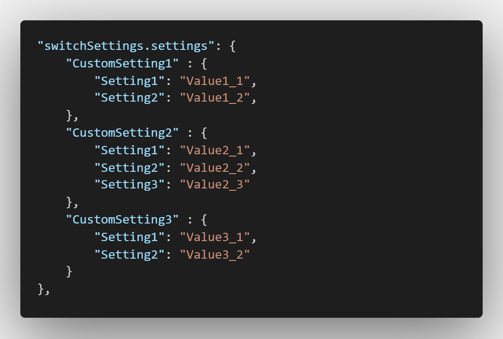
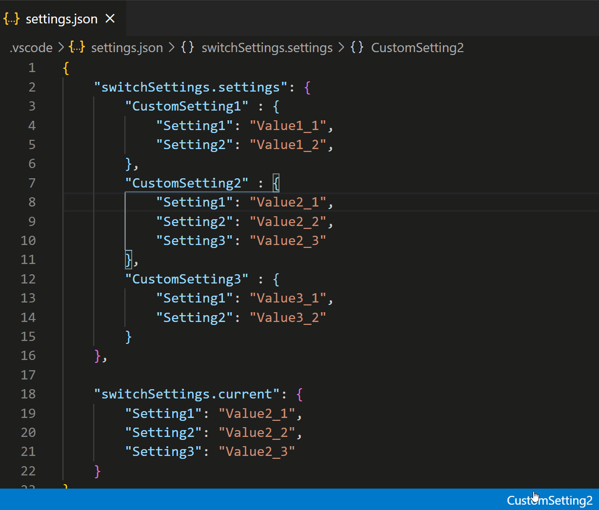

# Setting Switcher

With this extension it is possible to manage different custom settings in groups. Only one group is active at a time. The active group can be selected via the status bar. This allows to change settings for different scenarios.

## Features

The configuration can be simply done in the settings.json file. "switchSettings.settings" is an object where each key represents a group. Each group can contain any settings. In the following example the three groups CustomSetting1, CustomSetting2 and CustomSetting3 have been defined.

After the first definition you might have to reload the window.

Switch the current setting group via the status bar.

The object "switchSettings.current" will be added/changed after switching the current group.

If you want to access for example the current "Setting1" use the variable:
${config.switchSettings.current.Setting1}

However, this is just an example and any group and setting names are possible.